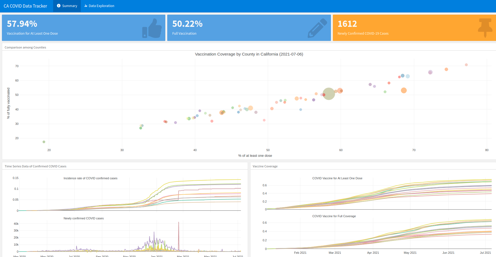
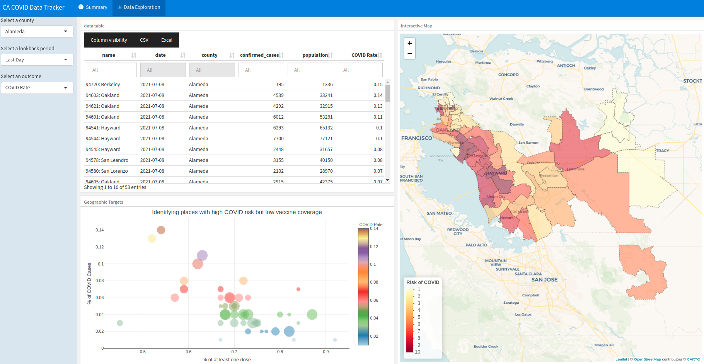

## Develop a Shiny Web App to track COVID cases and vaccination in California
### Data Source
This project uses public data organized by LA Times which come from a continual Times survey of California's 58 county health agencies and three city agencies, https://github.com/datadesk/california-coronavirus-data. Particularly, we used latimes-agency-totals.csv and 

#### latimes-agency-totals.csv
The total cases and deaths logged by local public health agencies each day. Each row contains the cumulative totals reported by a single agency as of that date.

Most counties have only one agency except for Alameda and Los Angeles counties, where some cities run independent health departments. In Alameda County, the city of Berkeley is managed independently. In Los Angeles County, Pasadena and Long Beach are managed independently. These cities' totals are broken out into separate rows. In order to calculate county-level totals, you must aggregate them together using the county field.

#### cdph-vaccination-zipcode-totals.csv
California's Department of Public Health is releasing zipcode-level vaccination totals. LA Times extracts and logs the data each day. Population estimates from the U.S. Census Bureau, gathered by The Times, are used to calculate the percentage of the total population that is vaccinated.

### Shiny Product
The shiny web app could be found in the following link, https://agdemo.shinyapps.io/COVID_Data_Tracking/. It includes two sections:
* A summary 
* Details by places

